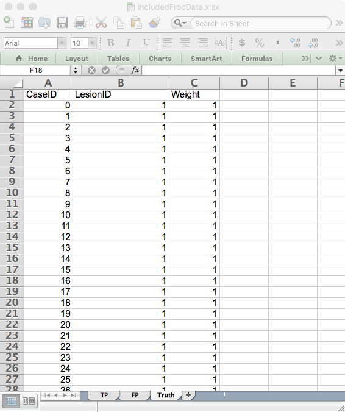
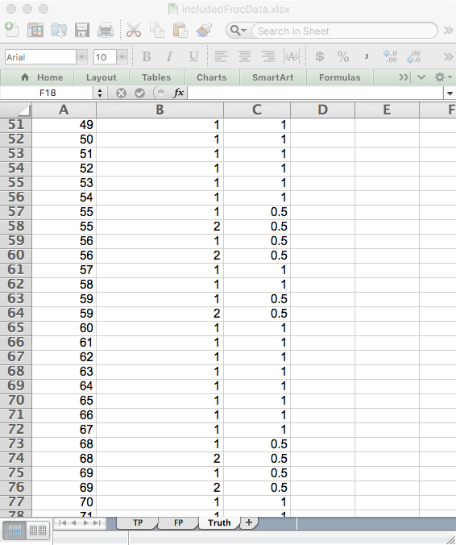
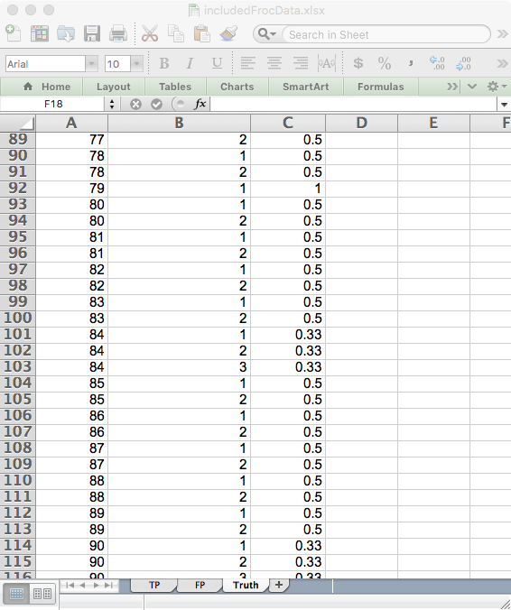
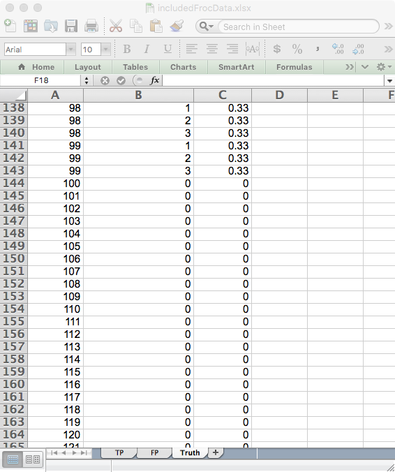
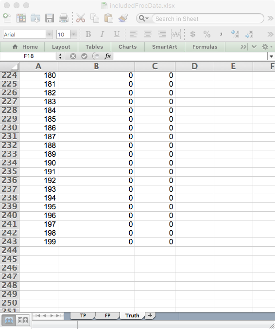

  
```{r setup, include = FALSE}
  knitr::opts_chunk$set(
  collapse = TRUE,
  comment = "#>"
  )
  library(RJafroc)
```

## Introduction
* In the free-response ROC (FROC) paradigm [@RN974] the observer **TBA**. FROC data consists of mark-rating pairs, where a mark a location that was considered suspicious for presence of a localized lesion and the rating is the confidence level. By adopting a proximity criterion, each mark is classified by the investigator as a lesion localization (LL) - if it is close to a real lesion - or a non-lesion localization (NL) otherwise. 

* The observer gives a single rating to each ROI, denoted ${{R}_{k}}$. The rating can be an integer or quasi- continuous (e.g., 0 – 100), or a floating point value, as long as higher numbers represent greater confidence in presence of one or more lesions in the ROI.

* ROI-level-normal ratings are stored in the `NL` field and ROI-level-abnormal ratings are stored in the `LL` field.  

* One can think of the ROI paradimg as similar to the FROC paradigm, but with localization accuracy restricted to belonging to a region (one cannot distinguish muttiple lesions within a region). Unlike the FROC paradigm, a rating *is required* for every ROI.


## An example ROI dataset

An example simulated ROI dataset is included as `dataset04`.
  
```{r}
str(dataset04)
dataset04$NL[1,1,1,]
mean(dataset04$NL[,,1:50,])
dataset04$NL[1,1,51,]
dataset04$lesionNum[1]
dataset04$LL[1,1,1,]
x <- dataset04$LL;mean(x[is.finite(x)])
```             
Examination of the output reveasl that:

* This is a 5-treatment 4-reader dataset, with 100 non-diseased cases and 100 diseased cases.   

* For treatment 1, reader 1, case 1 (the 1st non-diseased case) the 4 ratings are `r dataset04$NL[1,1,1,]`. The mean of all ratings on non-diseased cases is `r mean(dataset04$NL[,,1:50,])`.  

* For treatment 1, reader 1, case 51 (the 1st diseased case) the NL ratings are `r dataset04$NL[1,1,51,][is.finite(dataset04$NL[1,1,51,])]`. There are only two finite values because this case has two ROI-level-abnormal regions, and 2 plus 2 makes for the assumed 4-regions per case. The corresponding `$lesionNum` field is `r dataset04$lesionNum[1]`.   
* The ratings of the 2 ROI-level-abnormal ROIs on this case are `r dataset04$LL[1,1,1,][is.finite(dataset04$LL[1,1,1,])]`. The mean rating over all ROI-level-abnormal ROIs is `r mean(dataset04$LL[is.finite(dataset04$LL)])`.  

## The FROC  Excel data file
An Excel file in JAFROC format containing simulated ROI data corresponding to `dataset04`, is included with the distribution. The first command (below) finds the location of the file and the second command reads it and saves it to a dataset object `ds`.  
```{r}
fileName <- system.file(
    "extdata", "includedFrocData.xlsx", package = "RJafroc", mustWork = TRUE)
ds <- DfReadDataFile(fileName)
ds$dataType
```             
The `DfReadDataFile` function automatically recognizes that this is an *ROI* dataset. Its structure is similar to the JAFROC format Excel file, with some important differences, noted below. It contains three worksheets: 

{width=40%}{width=40%}
{width=40%}{width=40%}
{width=40%}


* The `Truth` worksheet - this indicates which cases are diseased and which are non-diseased and the number of ROI-level-abnormal region on each case.  
    + There are 50 normal cases (labeled 1-50) under column `CaseID` and 40 abnormal cases (labeled 51-90).  
    + The `LesionID` field for each normal case (e.g., `CaseID` = 1) is zero and there is one row per case. For abnormal cases, this field has a variable number of entries, ranging from 1 to 4. As an example, there are two rows for `CaseID` = 51 in the Excel file: one with `LesionID` = 2 and one with `LesionID` = 3.   
    + The `Weights` field is always zero (this field is not used in ROI analysis).  

{width=40%}
{width=40%}

* The `FP` (or `NL`)  worksheet - this lists the ratings of ROI-level-normal regions.  
    + For `ReaderID` = 1, `ModalityID` = 1 and `CaseID` = 1 there are 4 rows, corresponding to the 4 ROI-level-normal regions in this case. The corresponding ratings are `r dataset04$NL[1,1,1,][is.finite(dataset04$NL[1,1,1,])]`. The pattern repeats for other treatments and readers, but the rating are, of course, different.  
    + Each `CaseID` is represented in the `FP` worksheet (a rare exception could occur if a case-level abnormal case has 4 abnormal regions).

{width=40%}

* The `TP` (or `LL`) worksheet - this lists the ratings of ROI-level-abnormal regions.  
    + Because normal cases generate TPs, one does not find any entry with `CaseID` = 1-50 in the `TP` worksheet.   
    + The lowest `CaseID` in the `TP` worksheet is 51, which corresponds to the first abnormal case.   
    + There are two entries for this case, corresponding to the two ROI-level-abnormal regions present in this case. Recall that corresponding to this `CaseID` in the `Truth` worksheet there were two entries with `LesionID` = 2 and 3. These must match the `LesionID`'s listed for this case in the `TP` worksheet. Complementing these two entries, in the `FP` worksheet for `CaseID` = 51, there are 2 entries corresponding to the two ROI-level-normal regions in this case.   
    + One should be satisfied that for each abnormal case the sum of the number of entries in the `TP` and `FP` worksheets is always 4.  

## References  
