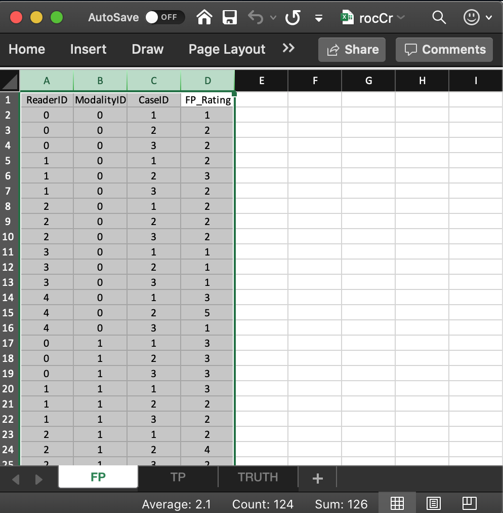

  
```{r setup, include = FALSE}
  knitr::opts_chunk$set(
  collapse = TRUE,
  comment = "#>"
  )
  library(RJafroc)
```

## Introduction
* The purpose of this vignette is to explain the data format of the input Excel file and to introduce the capabilities of the function `DfReadDataFile()`. Background on observer performance methods are in my book [@RN2680].
* I will start with Receiver Operating Characteristic (ROC) data [@RN1766] as this is by far the simplest paradigm.
* In the ROC paradigm the observer assigns a rating to each image. A rating is an ordered numeric label, and, in our convention, higher values represent greater certainty or **confidence level** for presence of disease. With human observers, a 5 (or 6) point rating scale is typically used, with 1 representing highest confidence for *absence* of disease and 5 (or 6) representing highest confidence for *presence* of disease. Intermediate values represent intermediate confidence levels for presence or absence of disease. 
* Note that location information, if applicable, associated with the disease, is not collected. 
* There is no restriction to 5 or 6 ratings. With algorithmic observers, e.g., computer aided detection (CAD) algorithms, the rating could be a floating point number and have infinite precision. All that is required is that higher values correspond to greater confidence in presence of disease.

## Note to existing users
* The Excel file format has recently undergone changes resulting in 4 extra `list` members in the final created `dataset` object (12 instead of 8). 
* Code which should ran on the old format Excel files as the 4 extra list members are simply ignored. 
* Reasons for the change will become clearer in these vignettes (basically they are needed for generalization to other data collection paradigms instead of crossed, for example to split-plot data acquisition paradigm) and for better data entry error control.


## The Excel data format
* The Excel file has three worksheets. These are named `Truth`, `NL` (or `FP`) and `LL` (or `TP`).

## The `Truth` worksheet 

The `Truth` worksheet contains 6 columns: `CaseID`, `LesionID`, `Weight`, `ReaderID`, `ModalityID` and `Paradigm`. 

* The first five columns contain as many rows as there are cases (images) in the dataset. 
* `CaseID`: unique **integers**, one per case, representing the cases in the dataset. 
* `LesionID`: integers 0 or 1, with each 0 representing a non-diseased case and each 1 representing a diseased case. 
* In the current toy dataset, the non-diseased cases are labeled `1`, `2` and `3`, while the diseased cases are labeled `70`, `71`, `72`, `73` and `74`. The values do not have to be consecutive integers; they need not be ordered; the only requirement is that they be **unique integers**.
* `Weight`: Not used for ROC data, a floating point value, typically filled in with 0 or 1. 
* `ReaderID`: a **comma-separated** listing of reader labels (one or more readers), each represented by a **unique integer**, that have interpreted the case. In the example shown below each cell has the value `0, 1, 2, 3, 4` meaning that each of these readers has interpreted all cases (hence the "crossed" design). **With multiple readers each cell in this column has to be text formatted as otherwise Excel will not accept it.**
* `ModalityID`: a comma-separated listing of modalities (one or more modalities), each represented by a **unique integer**, that are applied to each case. In the example each cell has the value `0, 1`. **With multiple modalities each cell has to be text formatted as otherwise Excel will not accept it.**
* `Paradigm`: this column contains two cells, `ROC` and `crossed`. It informs the software that this is an ROC dataset, and the design is crossed, meaning each reader has interpreted each case in each modality (in statistical terminology: modality and reader factors are "crossed"). 
* There are 5 diseased cases in the dataset (the number of 1's in the `LesionID` column of the `Truth` worksheet). 
* There are 3 non-diseased cases in the dataset (the number of 0's in the `LesionID` column).
* There are 5 readers in the dataset (each cell in the `ReaderID` column contains the string `0, 1, 2, 3, 4`).
* There are 2 modalities in the dataset (each cell in the `ModalityID` column contains the string `0, 1`).

{width=100%}

## The structure of an ROC dataset
The example shown above corresponds to Excel file `inst/extdata/toyFiles/ROC/rocCr.xlsx` in the project directory. *Toy files* are artificial small datasets intended to illustrate essential features of the data format.  In the following code chunk the first statement retrieves the name of the data file, located in a hidden directory that one need not be concerned with. The second statement reads the file using the function `DfReadDataFile()` and saves it to object `x`. The third statement shows the structure of the dataset object `x`.

```{r}
rocCr <- system.file("extdata", "toyFiles/ROC/rocCr.xlsx",
                        package = "RJafroc", mustWork = TRUE)
x <- DfReadDataFile(rocCr, newExcelFileFormat = TRUE)
str(x)
```             

* In the above code chunk flag `newExcelFileFormat` is set to `TRUE` as otherwise columns D - F in the `Truth` worksheet are ignored and the dataset is assumed to be crossed, with `dataType` automatically determined from the contents of the FP and TP worksheets. 
* Flag `newExcelFileFormat = FALSE` is for compatibility with older JAFROC format Excel files, which did not have these columns in the `Truth` worksheet. Its usage is deprecated.
* The dataset object `x` is a `list` variable with `r length(x)` members. 
* The `x$NL` member, with dimension [2, 5, 8, 1], contains the ratings of normal cases. The extra values in the third dimension, filled with `NAs`, are needed for compatibility with FROC datasets.
* The `x$LL`, with dimension [2, 5, 5, 1], contains the ratings of abnormal cases.
* The `x$lesionVector` member is a vector with 5 ones representing the 5 diseased cases in the dataset. 
* The `x$lesionID` member is an array with 5 ones.
* The `x$lesionWeight` member is an array with 5 ones.
* The `lesionVector`, `lesionID` and `lesionWeight` members are not used for ROC datasets. They are there for compatibility with FROC datasets.
* The `dataType` member indicates that this is an `ROC` dataset. 
* The `x$modalityID` member is a vector with two elements `"0"` and `"1"`, naming the two modalities. 
* The `x$readerID` member is a vector with five elements  `"0"`, `"1"`, `"2"`, `"3"` and `"4"`, naming the five readers. 
* The `x$design` member is `r x$design`; specifies the dataset design, which is "CROSSED".
* The `x$normalCases` member lists the integer names of the normal cases, `r x$normalCases`. 
* The `x$abnormalCases` member lists the integer names of the abnormal cases, `r x$abnormalCases`. 
* The `x$truthTableStr` member quantifies the structure of the dataset, as explained in **Vignette #3**. **It is used in the `DfReadDataFile()` function to check for data entry errors.**

## The false positive (FP) ratings
These are found in the `FP` or `NL` worksheet, see below.
{width=100%}

* It consists of 4 columns, each of length 30 (= # of modalities times number of readers times number of non-diseased cases). 
* `ReaderID`: the reader labels: `0`, `1`, `2`, `3` and `4`. Each reader label occurs 6 times (= # of modalities times number of non-diseased cases). 
* `ModalityID`: the modality or treatment labels: `0` and `1`. Each label occurs 15 times (= # of readers times number of non-diseased cases). 
* `CaseID`: the case labels for non-diseased cases: `1`, `2` and `3`. Each label occurs 10 times (= # of modalities times # of readers). 
* The label of a diseased case cannot occur in the FP worksheet. If it does the software generates an error. 
* `FP_Rating`: the floating point ratings of non-diseased cases. Each row of this worksheet contains a rating corresponding to the values of `ReaderID`, `ModalityID` and `CaseID` for that row.  

## The true positive (TP) ratings
These are found in the `TP` or `LL` worksheet, see below.
{width=100%}

* It consists of 5 columns, each of length 50 (= # of modalities times number of readers times number of diseased cases). 
* `ReaderID`: the reader labels: `0`, `1`, `2`, `3` and `4`. Each reader label occurs 10 times (= # of modalities times number of diseased cases). 
* `ModalityID`: the modality or treatment labels: `0` and `1`. Each label occurs 25 times (= # of readers times number of diseased cases). 
* `LesionID`: For an ROC dataset this column contains fifty 1's (each diseased case has one lesion). 
* `CaseID`: the case labels for non-diseased cases: `70`, `71`, `72`, `73` and `74`. Each label occurs 10 times (= # of modalities times # of readers). The label of a non-diseased case cannot occur in the TP worksheet. 
* `TP_Rating`: the floating point ratings of diseased cases. Each row of this worksheet contains a rating corresponding to the values of `ReaderID`, `ModalityID`, `LesionID` and `CaseID` for that row.   

## Correspondence between `NL` member of dataset and the `FP` worksheet
* The list member `x$NL` is an array with `dim = c(2,5,8,1)`. 
    + The first dimension (2) comes from the number of modalities. 
    + The second dimension (5) comes from the number of readers. 
    + The third dimension (8) comes from the **total** number of cases. 
    + The fourth dimension is alway 1 for an ROC dataset. 
* The value of `x$NL[1,5,2,1]`, i.e., `r x$NL[1,5,2,1]`, corresponds to row 15 of the FP table, i.e., to `ModalityID` = 0, `ReaderID` = 4 and `CaseID` = 2.
* The value of `x$NL[2,3,2,1]`, i.e., `r x$NL[2,3,2,1]`, corresponds to row 24 of the FP table, i.e., to `ModalityID` 1, `ReaderID` 2 and `CaseID` 2.
* All values for case index > 3 are `-Inf`. For example the value of `x$NL[2,3,4,1]` is `-Inf`. This is because there are only 3 non-diseased cases. The extra length is needed for compatibility with FROC datasets.

## Correspondence between `LL` member of dataset and the `TP` worksheet
* The list member `x$LL` is an array with `dim = c(2,5,5,1)`. 
    + The first dimension (2) comes from the number of modalities. 
    + The second dimension (5) comes from the number of readers. 
    + The third dimension (5) comes from the number of diseased cases. 
    + The fourth dimension is alway 1 for an ROC dataset. 

* The value of `x$LL[1,1,5,1]`, i.e., `r x$LL[1,1,5,1]`, corresponds to row 6 of the TP table, i.e., to `ModalityID` = 0, `ReaderID` = 0 and `CaseID` = 74.
* The value of `x$LL[1,2,2,1]`, i.e., `r x$LL[1,2,2,1]`, corresponds to row 8 of the TP table, i.e., to `ModalityID` = 0, `ReaderID` = 1 and `CaseID` = 71.
* There are no -Inf values in `x$LL`: `any(x$LL == -Inf)` = `r any(x$LL == -Inf)`.

## Correspondence using the `which` function 
* Converting from **names** to integer-indices (indicating position in an array) can be confusing. 
* The following example uses the `which` function to help out.
* The first line says that the `abnormalCase` named 70 corresponds to position (or index) 1 in the LL array case dimension. 
* The second line prints the NL rating for `modalityID` = 0, `readerID` = 1 and `normalCase` = 1.
* The third line prints the LL rating for `modalityID` = 0, `readerID` = 1 and `abnormalCase` = 70.
* The last line shows what happens if one enters an invalid value for the name; the result is a `numeric(0)`.
* The reader is encouraged to examine the correspondence between the NL and LL ratings and the Excel file using this method.

```{r}
which(x$abnormalCases == 70)
x$NL[which(x$modalityID == "0"),which(x$readerID == "1"),which(x$normalCases == 1),1]
x$LL[which(x$modalityID == "0"),which(x$readerID == "1"),which(x$abnormalCases == 70),1]
x$LL[which(x$modalityID == "a"),which(x$readerID == "1"),which(x$abnormalCases == 70),1]
```             


## References  
