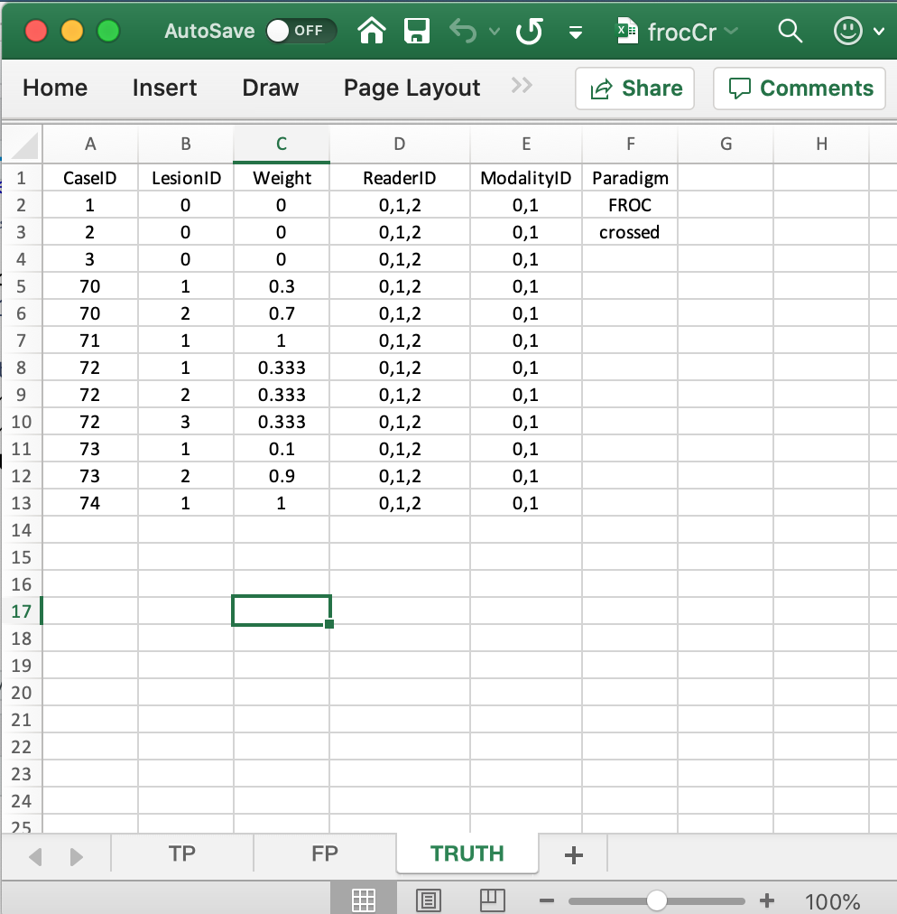
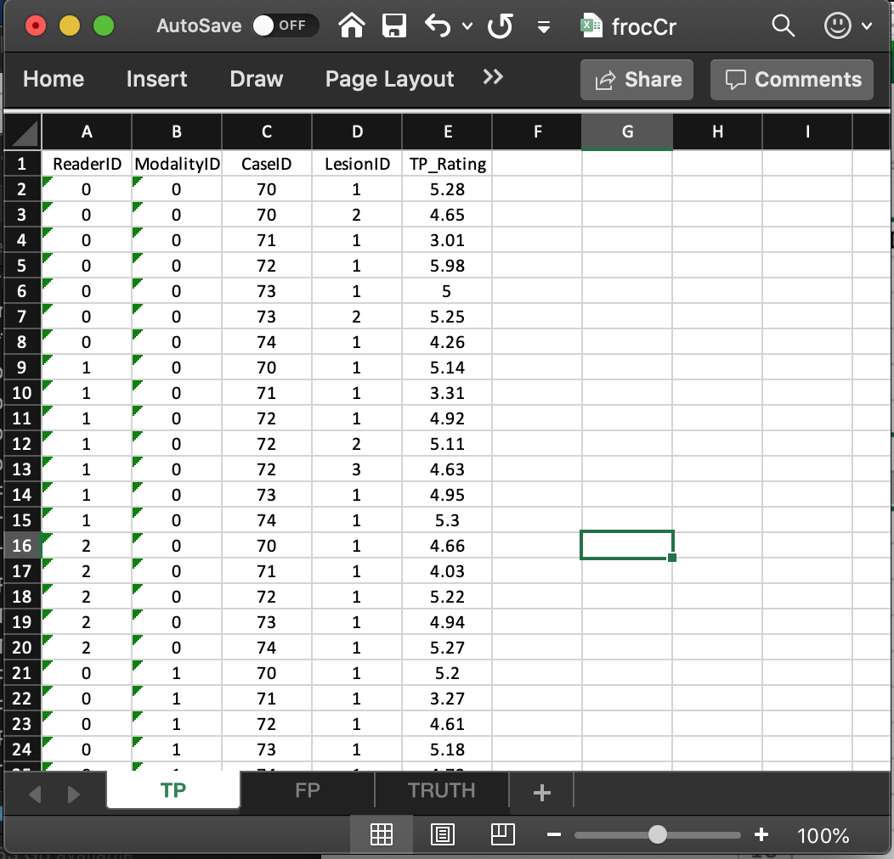

  
```{r setup, include = FALSE}
  knitr::opts_chunk$set(
  collapse = TRUE,
  comment = "#>"
  )
  library(RJafroc)
```

## Purpose
* Explain the data format of the input Excel file for FROC datasets. 
* Explain the format of the FROC dataset.
* Explain the lesion distribution array returned by `UtilLesionDistr()`.
* Explain the lesion weights array returned by `UtilLesionWeightsDistr()`.
* Details on the FROC paradigm are in my book [@RN2680].

## Introduction
* In the Free-response Receiver Operating Characteristic (FROC) paradigm the observer searches each case for signs of **localized disease** and marks and rates localized regions that are sufficiently suspicious for presence of disease.
* FROC data consists of **mark-rating pairs**, where each mark is a localized-region that was considered sufficiently suspicious for presence of a localized lesion and the rating is it's confidence level. As in the ROC paradigm, the rating can be an integer or quasi-continuous (e.g., 0 – 100), or a floating point value, *as long as higher numbers represent greater confidence in presence of a lesion at the indicated region*. This is termed a positive-directed confidence level scheme. 
* By adopting a proximity criterion, the investigator classifies each mark as a lesion localization (`LL`) - if it is close to a real lesion - or a non-lesion localization (`NL`) otherwise. 
* The vignette is illustrated with a toy data file, `inst/extdata/toyFiles/ROC/rocSpA.xlsx` in which readers '0', '1' and '2' interpret 8 cases in two modalities, '0' and '1'.
* The design is 'factorial', abbreviated to `FCTRL` in the software; this is also termed a 'fully-crossed' design.
* The Excel file has three worksheets named `Truth`, `NL` (or `FP`) and `LL` (or `TP`). 
* All cells need to text formatted: select the worksheet, then Format - Cells - Number - Text OK.

## The `Truth` worksheet 
* The `Truth` worksheet contains 6 columns: `CaseID`, `LesionID`, `Weight`, `ReaderID`, `ModalityID` and `Paradigm`. 
* Since a diseased case may have more than one lesion, the first five columns contain **at least** as many rows as there are cases (images) in the dataset. There are 8 cases in the dataset and 12 rows of data, because some of the abnormal cases contain more than one lesion.
* `CaseID`: unique **integers** representing the cases in the dataset: '1', '2', '3', the 3 normal cases, and '70', '71', '72', '73', '74', the 5 abnormal cases. 
* `LesionID`: integers 0, 1, 2, etc., with each 0 representing a non-diseased case, each 1 representing the *first* lesion on a diseased case, 2 the second lesion, if present, and so on. 
* This field is zero for normal cases '1', '2', '3'. 
* For the first abnormal case, i.e., '70', it is 2, for case '71', it is 1, etc.
* There are 3 non-diseased cases in the dataset (the number of 0's in the `LesionID` column).
* There are 5 diseased cases in the dataset (the number of 1's in the `LesionID` column). 
* There are 3 readers in the dataset, as each cell in the `ReaderID` column contains '0, 1, 2'.
* There are 2 modalities in the dataset, as each cell in the `ModalityID` column contains '0, 1'.
* `Weight`: floating point; 0, for each non-diseased case, or, for each diseased case, values that sum to unity.  
* Diseased case `70` has two lesions, with `LesionID`s '1' and '2', and weights 0.3 and 0.7. 
* Diseased case `71` has one lesion, with `LesionID` = 1, and `Weight` = 1. 
* Diseased case `72` has three lesions, with `LesionID`s 1, 2 and 3 and weights 1/3 each. 
* Diseased case `73` has two lesions, with `LesionID`s 1, and 2 and weights 0.1 and 0.9. 
* Diseased case `74` has one lesion, with `LesionID` = 1 and `Weight` = 1.
* `ReaderID`: a comma-separated listing of readers, each represented by a unique **text label**, that have interpreted the case. In the example shown below each cell has the value '0, 1, 2'. 
* `ModalityID`: a comma-separated listing of modalities (or treatments), each represented by a unique **integer**, that apply to each case. In the example each cell has the value `0, 1`. **Each cell has to be text formatted.**
* `Paradigm`: The contents are `FROC` and `FCTRL`. 
* It informs the software that this is an `FROC` dataset and the design is "factorial".

{width=100%}

## The structure of an FROC dataset
The example shown above corresponds to Excel file `inst/extdata/toyFiles/FROC/frocCr.xlsx` in the project directory. 

```{r}
frocCr <- system.file("extdata", "toyFiles/FROC/frocCr.xlsx",
                        package = "RJafroc", mustWork = TRUE)
x <- DfReadDataFile(frocCr, newExcelFileFormat = TRUE)
str(x)
```             

* This follows the general description in **Vignette #1**. The differences are described below.
* The `x$descriptions$type` member indicates that this is an `FROC` dataset. 
* The `x$lesions$perCase` member is a vector whose contents reflect the number of lesions in each diseased case, i.e., `r x$lesions$perCase` in the current example.
* The `x$lesions$IDs` member indicates the labeling of the lesions in each diseased case.

```{r}
x$lesions$IDs
```             

* This shows that the lesions on the first diseased case are labeled '1' and '2'. The `-Inf` is a filler used to denote a missing value. The second diseased case has one lesion labeled '1'. The third diseased case has three lesions labeled '1', '2' and '3', etc.
* The `lesionWeight` member is the clinical importance of each lesion. Lacking specific clinical reasons, the lesions should be equally weighted; this is *not* true for this toy dataset.

```{r}
x$lesions$weights
```             

* The first diseased case has two lesions, the first has weight 0.3 and the second has weight 0.7. The second diseased case has one lesion with weight 1.The third diseased case has three equally weighted lesions, each with weight 1/3. Etc.

## The false positive (FP) ratings
These are found in the `FP` or `NL` worksheet.
{width=100%}

* It consists of 4 columns, of equal length. **The common length is unpredictable.** It could be zero if the dataset has no NL marks (a possibility if the lesions are very easy to find and the modality and/or the observer has perfect performance). The common length is an integer random variable greater than or equal to zero. 
* In the example dataset, the common length is `r sum(x$ratings$NL != -Inf)`.
* `ReaderID`: the reader labels: these must be `0`, `1`, or `2`, as declared in the `Truth` worksheet. 
* `ModalityID`: the modality labels: must be `0` or `1`, as declared in the `Truth` worksheet. 
* `CaseID`: the labels of cases with `NL` marks. In the FROC paradigm, `NL` events can occur on non-diseased **and** diseased cases. 
* `FP_Rating`: the floating point ratings of `NL` marks. Each row of this worksheet yields a rating corresponding to the values of `ReaderID`, `ModalityID` and `CaseID` for that row.
* For `ModalityID` 0, `ReaderID` 0 and `CaseID` 1 (the first non-diseased case declared in the `Truth` worksheet), there is a single `NL` mark that was rated `r x$ratings$NL[1,1,1,1]`, corresponding to row 2 of the `FP` worksheet.
* Diseased cases with `NL` marks are also recorded in the `FP` worksheet. Some examples are seen at rows 15, 16 and 21-23 of the `FP` worksheet. 
* Rows 21 and 22 show that `caseID` = 71 got two `NL` marks, rated `r x$ratings$NL[2,3,5,1:2]`. 
* That this is the *only* case with two NL marks determines the length of the fourth dimension of the `x$ratings$NL` list member, `r length(x$ratings$NL[1,1,1,])` in the current example. Absent this case, the length would have been one.
* In general, the case with the most `NL` marks determines the length of the fourth dimension of the `x$ratings$NL` list member.
* The reader should convince oneself that the ratings in `x$ratings$NL` reflect the contents of the `FP` worksheet.

## The true positive (TP) ratings
These are found in the `TP` or `LL` worksheet, see below.

{width=100%}

* This worksheet can only have diseased cases. The presence of a non-diseased case in this worksheet will generate an error.
* The common vertical length, 31 in this example, is a-priori unpredictable. Given the structure of the `Truth` worksheet, the maximum length would be 9 times 2 times 3, assuming every lesion is marked for each modality, reader and diseased case. The 9 comes from the total number of non-zero entries in the `LesionID` column of the `Truth` worksheet.
* The fact that the length is smaller than the maximum length means that there are combinations of modality, reader and diseased cases on which some lesions were not marked.
* As an example, the first lesion in `CaseID` equal to `70` was marked (and rated `r x$ratings$LL[1,1,1,1]`) in `ModalityID` `0` and `ReaderID` `0`. 
* The length of the fourth dimension of the `x$ratings$LL` list member, `r length(x$ratings$LL[1,1,1,])` in the present example, is determined by the diseased case with the most lesions in the `Truth` worksheet.
* The reader should convince oneself that the ratings in `x$ratings$LL` reflect the contents of the `TP` worksheet.

## On the distribution of numbers of lesions in abnormal cases  
* Consider a much larger dataset, `dataset11`, with structure as shown below:

```{r}
x <- dataset11
str(x)
```

* Focus for now in the 115 abnormal cases. 
* The numbers of lesions in these cases is contained in `x$lesions$perCase`.

```{r}
x$lesions$perCase
```

* For example, the first abnormal case contains 6 lesions, the second contains 4 lesions, the third contains 7 lesions, etc. and the last abnormal case contains 1 lesion.
* To get an idea of the distribution of the numbers of lesions per abnormal cases, one could interrogate this vector as shown below using the `which()` function:

```{r}
for (el in 1:max(x$lesions$perCase)) cat(
  "abnormal cases with", el, "lesions = ", 
  length(which(x$lesions$perCase == el)), "\n")
```

* This tells us that 25 cases contain 1 lesion
* Likewise, 23 cases contain 2 lesions
* Etc.

### Definition of `lesDistr` array
* Let us ask what is the fraction of (abnormal) cases with 1 lesion, 2 lesions etc.

```{r}
for (el in 1:max(x$lesions$perCase)) cat("fraction of abnormal cases with", el, "lesions = ", 
                                              length(which(x$lesions$perCase == el))/length(x$ratings$LL[1,1,,1]), "\n")
```

* This tells us that fraction 0.217 of (abnormal) cases contain 1 lesion
* And fraction 0.2 of (abnormal) cases contain 2 lesions
* Etc.
* This information is contained the the `lesDistr` array
* It is coded in the `Utility` function `UtilLesionDistr()` 

```{r}
lesDistr <- UtilLesionDistr(x)
lesDistr
```

* The `UtilLesionDistr()` function returns an array with two columns and number of rows equal to the number of distinct values of lesions per case.
* The first column contains the number of distinct values of lesions per case, 14 in the current example.
* The second column contains the fraction of diseased cases with the number of lesions indicated in the first column.
* The second column must sum to unity

```{r}
sum(UtilLesionDistr(x)[,2])
```

* The lesion distribution array will come in handy when it comes to predicting the operating characteristics from using the Radiological Search Model (RSM), as detailed in Chapter 17 of my book.


## Definition of `lesWghtDistr` array
* This is returned by `UtilLesionWeightsDistr()`.
* This contains the same number of rows as `lesDistr`.
* The number of columns is one plus the number of rows as `lesDistr`.
* The first column contains the number of distinct values of lesions per case, 14 in the current example.
* The second column contains the weights of cases with number of lesions per case corresponding to row 1.
* The third column contains the weights of cases with number of lesions per case corresponding to row 2.
* Etc.
* Missing values are filled with `-Inf`.

```{r}
lesWghtDistr <- UtilLesionWeightsDistr(x)
cat("dim(lesDistr) =", dim(lesDistr),"\n")
cat("dim(lesWghtDistr) =", dim(lesWghtDistr),"\n")
cat("lesWghtDistr = \n\n")
lesWghtDistr
```

* Row 3 corresponds to 3 lesions per case and the weights are 1/3, 1/3 and 1/3.
* Row 13 corresponds to 16 lesions per case and the weights are 0.06250000, 0.06250000, ..., repeated 13 times.
* Note that the number of rows is less than the maximum number of lesions per case (20).
* This is because some configurations of lesions per case (e.g., cases with 13 lesions per case) do not occur in this dataset. 

## Summary  
* The FROC dataset has far less regularity in structure as compared to an ROC dataset.
* The length of the first dimension of either `x$ratings$NL` or `x$ratings$LL` is the total number of modalities, 2 in the current example.
* The length of the second dimension of either `x$ratings$NL` or `x$ratings$LL` list members is the total number of readers, 3 in the current example.
* The length of the third dimension of `x$ratings$NL` is the total number of cases, 8 in the current example. The first three positions account for `NL` marks on non-diseased cases and the remaining 5 positions account for `NL` marks on diseased cases.
* The length of the third dimension of `x$ratings$LL` is the total number of diseased cases, 5 in the current example. 
* The length of the fourth dimension of `x$ratings$NL` is determined by the case (diseased or non-diseased) with the most `NL` marks, 2 in the current example.
* The length of the fourth dimension of `x$ratings$LL` is determined by the diseased case with the most lesions, 3 in the current example.


## References  
