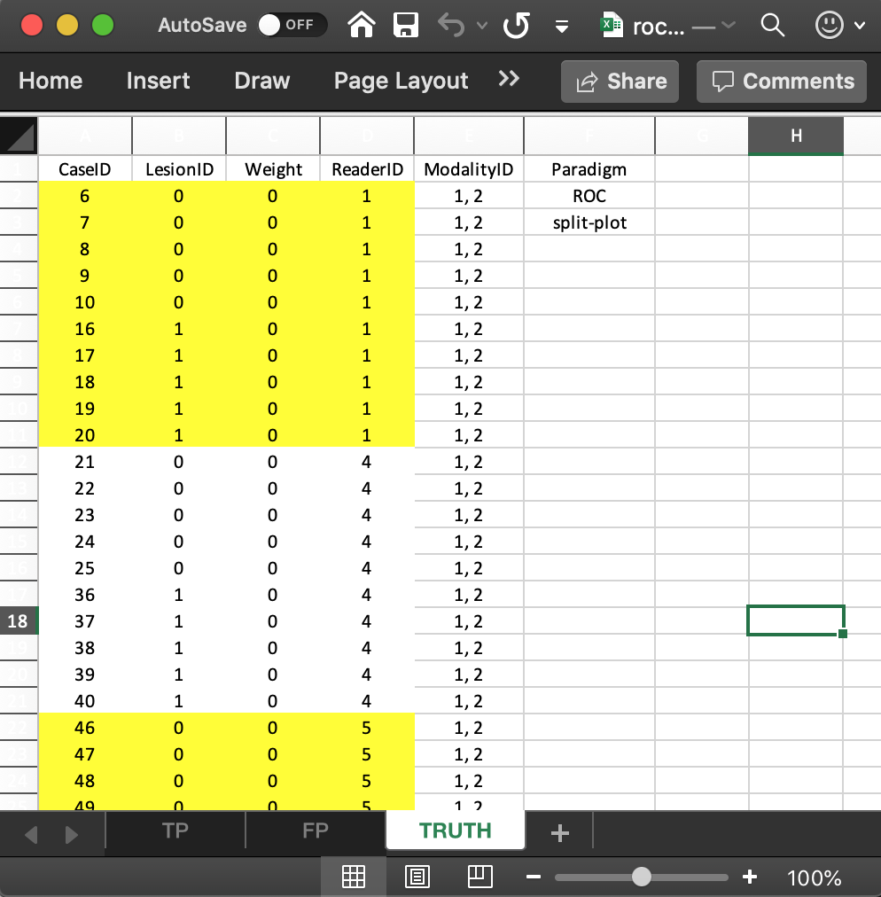

  
```{r setup, include = FALSE}
  knitr::opts_chunk$set(
  collapse = TRUE,
  comment = "#>"
  )
  library(RJafroc)
```

## Introduction
* The purpose of this vignette is to explain the data format of the input Excel file for an ROC *split-plot* dataset.
* In a split-plot dataset each reader interprets a *different* sub-set of cases in all modalities, i.e., the cases interpreted by different readers have no overlap.
* Each sub-set of cases can have different numbers of non-diseased and diseased cases.
* The example below assumes the same numbers of non-diseased and diseased cases.
* The data format has been extended to `NewFormat` to allow such datasets.

## The Excel data format
As before,the Excel file has three worsheets named `Truth`, `NL` or `FP` and `LL` or `TP`. The Excel file corresponding to the example that follows is `inst/extdata/toyFiles/ROC/rocSp.xlsx`. 

## The `Truth` worksheet 
The `Truth` worksheet contains 6 columns: `CaseID`, `LesionID`, `Weight`, `ReaderID`, `ModalityID` and `Paradigm`. 

* The first five columns contain as many rows as there are cases in the dataset. 
* `CaseID`: unique **integers**, one per case, representing the cases in the dataset. 
* `LesionID`: integers 0, representing non-diseased cases and 1 representing the diseased cases. 
* The `ReaderID` column is a listing of readers each represented by a **unique string**. Note that, unlike the crossed design, the `ReaderID` column has  *single values*. **Each cell has to be text formatted.**
* The non-diseased cases interpreted by reader with `ReaderID` value `1` are labeled `6`, `7`, `8`, `9` and `10`, each with `LesionID` value `0`. 
* The diseased cases interpreted by this reader are labeled `16`, `17`, `18`, `19` and `20`, each with `LesionID` value `1`.  
* The second reader, with `ReaderID` value `4`, interprets five non-diseased cases labeled `21`, `22`, `23`, `24` and `25`, each with `LesionID` value `0`, and five diseased cases labeled `36`, `37`, `38`, `39` and `40`, each with `LesionID` value `1`.  
* The third reader, with ReaderID value `5`, interprets five non-diseased cases labeled `46`, `47`, `48`, `49` and `50`, each with `LesionID` value `0` and five diseased cases labeled `51`, `52`, `53`, `54` and `55`, each with `LesionID` value `1`.  
* `Weight`: floating point value 0 - this is not used for ROC data.  
* `ModalityID`: a comma-separated listing of modalities, each represented by a **unique string**. In the example shown below each cell has the value `1, 2`. **Each cell has to be text formatted.**
* `Paradigm`: In the example shown in this vignette, the contents are `ROC` and `split-plot`. 

```{r, echo=FALSE,out.width="50%",out.height="20%",fig.cap="Fig. 1: Truth worksheet for file inst/extdata/toyFiles/ROC/rocSp.xlsx",fig.show='hold',fig.align='center'}

``` 

## The structure of the ROC split plot dataset
* The example shown in Fig. 1 corresponds to Excel file `inst/extdata/toyFiles/ROC/rocSp.xlsx` in the project directory. 

```{r}
rocSp <- system.file("extdata", "toyFiles/ROC/rocSp.xlsx",
                        package = "RJafroc", mustWork = TRUE)
x <- DfReadDataFile(rocSp, newExcelFileFormat = TRUE)
str(x)
```             

*  `DfReadDataFile()` flag `newExcelFileFormat` **must** be set to `TRUE` for split plot data. 
* The dataset object `x` is a `list` variable with `r length(x)` members. 
* There are 15 diseased cases in the dataset (the number of 1's in the `LesionID` column of the `Truth` worksheet) and 15 non-diseased cases (the number of 0's in the `LesionID` column). 
* `x$NL`, with dimension [2, 3, 30, 1], contains the ratings of normal cases. The extra values in the third dimension, filled with `NAs`, are needed for compatibility with FROC datasets.
* `x$LL`, with dimension [2, 3, 15, 1], contains the ratings of abnormal cases.
* The `x$lesionVector` member is a vector with 15 ones representing the 15 diseased cases in the dataset. 
* The `x$lesionID` member is an array with 15 ones (this member is needed for compatibility with FROC datasets).
* The `x$lesionWeight` member is an array with 15 ones (this member is needed for compatibility with FROC datasets).
* The `dataType` member is `r x$dataType` which specifies the data collection method ("ROC", "FROC", "LROC" or "ROI"). 
* The `x$modalityID` member is a vector with two elements `"1"` and `"2"`, naming the two modalities. 
* The `x$readerID` member is a vector with three elements `"1"`, `"4"` and `"5"`, naming the three modalities. 
* The `x$design` member is `r x$design`; specifies the dataset design, which can be either "CROSSED" or "SPLIT-PLOT". 
* The `x$normalCases` member lists the names of the normal cases, `r x$normalCases`. 
* The `x$abnormalCases` member lists the names of the abnormal cases, `r x$abnormalCases`. 
* The `x$truthTableStr` member quantifies the structure of the dataset, as explained next. **It is used in the `DfReadDataFile()` function to check for data entry errors.**

## The `truthTableStr` member 
* This is a `2 x 3 x 30 x 2` array, i.e., I x J x K x (maximum number of lesions per case plus 1). The `plus 1 ` is needed to accommodate normal cases with `lesionID` = 0. [Zero is not a valid array subscript in `R`.]
* Each entry in this array is either `1`, meaning the corresponding interpretation exists, or `NA`,  meaning the corresponding interpretation does not exist. 
* For example, `x$truthTableStr[1,1,1,1]` is `r x$truthTableStr[1,1,1,1]`. This means that an interpretation exists for the first treatment (`modalityID` = 1), first reader (`readerID` = 1) and first (normal) case (`caseID` = 6 and `lesionID` = 0). This example corresponds to row 2 in the `TRUTH` worksheet.
* The following shows that the first reader interprets the first five normal cases in both modalities. 

```{r}
x$truthTableStr[,1,1:15,1]
```             

* In the following all elements are `NA` because normal cases correspond to lesionID = 1. 

```{r}
x$truthTableStr[,1,1:15,2]
```             

* The following shows that the second reader interprets the next group of five normal cases, indexed 6 through 10, in both modalities. 

```{r}
x$truthTableStr[,2,1:15,1]
```             

* The following shows that the third reader interprets the next group of five normal cases, indexed 11 through 15, in both modalities. 

```{r}
x$truthTableStr[,3,1:15,1]
```             

* The following shows that the first reader interprets the first group of five abnormal cases, indexed 16 through 20, in both modalities. 

```{r}
x$truthTableStr[,1,16:30,2]
```             

* In the following all elements are `NA` because abnormal cases correspond to `lesionID` = 2.

```{r}
x$truthTableStr[,1,16:30,1]
```             

```{r, echo=FALSE,out.width="50%",out.height="20%",fig.cap="Fig. 2 FP/TP worksheets; LEFT=FP, (b) RIGHT=TP",fig.show='hold',fig.align='center'}
knitr::include_graphics(c("images/rocSpFp.png","images/rocSpTp.png"))
``` 

## The false positive (FP) ratings
* These are found in the `FP` or `NL` worksheet, see Fig. 2, left panel.
* This worksheet has the ratings of non-diseased cases. 
* The common vertical length is 30 in this example (2 modalities times 3 readers times 5 non-diseased cases per reader). 
* `ReaderID`: the reader labels: these must be from `1`, `4` or `5`, as declared in the `Truth` worksheet. 
* `ModalityID`: the modality labels: `1` or `2`, as declared in the `Truth` worksheet. 
* `CaseID`: the labels of non-diseased cases. Each `CaseID` - `ReaderID` combination must be consistent with that declared in the `Truth` worsheet.  
* `NL_Rating`: the floating point ratings of non-diseased cases. Each row of this worksheet yields a rating corresponding to the values of `ReaderID`, `ModalityID` and `CaseID` for that row.


```{r}
x$NL[,1,1:15,1]
x$NL[,2,1:15,1]
x$NL[,3,1:15,1]
```             

* The first line of the above code shows the ratings, in both modalities, of the first five non-diseased cases with `CaseID`s `6,7,8,9,10` (indexed `r 1:5` and appearing in the first five columns) interpreted by the first reader (`ReaderID` 1).
* The second line shows the ratings, in both modalities, of the next five non-diseased cases with `CaseID`s `21,22,23,24,25` (indexed `r 6:10`and appearing in the next five columns) interpreted by the second reader (`ReaderID` 4).
* The third line shows the ratings, in both modalities, of the final five non-diseased cases with `CaseID`s `46,47,48,49,50` (indexed `r 11:15`and appearing in the final five columns) interpreted by the third reader (`ReaderID` 5).
* Values such as `x$NL[,,16:30,1]`, which are there for compatibility with FROC data, are all filled with `-Inf`.

## The true positive (TP) ratings
* These are found in the `TP` or `LL` worksheet, see Fig. 2, right panel.
* This worksheet has the ratings of diseased cases. 
* The common vertical length is 30 in this example (2 modalities times 3 readers times 5 diseased cases per reader). 
* `ReaderID`: the reader labels: these must be from `1`, `4` or `5`, as declared in the `Truth` worksheet. 
* `ModalityID`: the modality labels: `1` or `2`, as declared in the `Truth` worksheet. 
* `CaseID`: the labels of diseased cases. Each `CaseID` - `ReaderID` combination must be consistent with that declared in the `Truth` worsheet.  
* `LL_Rating`: the floating point ratings of diseased cases. Each row of this worksheet yields a rating corresponding to the values of `ReaderID`, `ModalityID` and `CaseID` for that row.


```{r}
x$LL[,1,1:15,1]
x$LL[,2,1:15,1]
x$LL[,3,1:15,1]
```             

* The first line of code shows the ratings, in both modalities, of the first five diseased cases with `CaseID`s `16,17,18,19,20` (indexed `r 1:5`and appearing in the first five columns) interpreted by the first reader (`ReaderID` 1).
* The second line shows the ratings, in both modalities, of the next five diseased cases with `CaseID`s `36,37,38,39,40` (indexed `r 6:10`and appearing in the next five columns) interpreted by the second reader (`ReaderID` 4).
* The third line shows the ratings, in both modalities, of the final five non-diseased cases with `CaseID`s `51,52,53,54,55` (indexed `r 11:15`and appearing in the final five columns) interpreted by the third reader (`ReaderID` 5).


## Summary  
* The FROC dataset has far less regularity in structure as compared to an ROC dataset.
* The length of the first dimension of either `x$NL` or `x$LL` list members is the total number of modalities, 2 in the current example.
* The length of the second dimension of either `x$NL` or `x$LL` list members is the total number of readers, 3 in the current example.
* The length of the third dimension of `x$NL` is the total number of cases, 8 in the current example. The first three positions account for `NL` marks on non-diseased cases and the remaining 5 positions account for `NL` marks on diseased cases.
* The length of the third dimension of `x$LL` is the total number of diseased cases, 5 in the current example. 
* The length of the fourth dimension of `x$NL` is determined by the case (diseased or non-diseased) with the most `NL` marks, 2 in the current example.
* The length of the fourth dimension of `x$LL` is determined by the diseased case with the most lesions, 3 in the current example.


## References  
