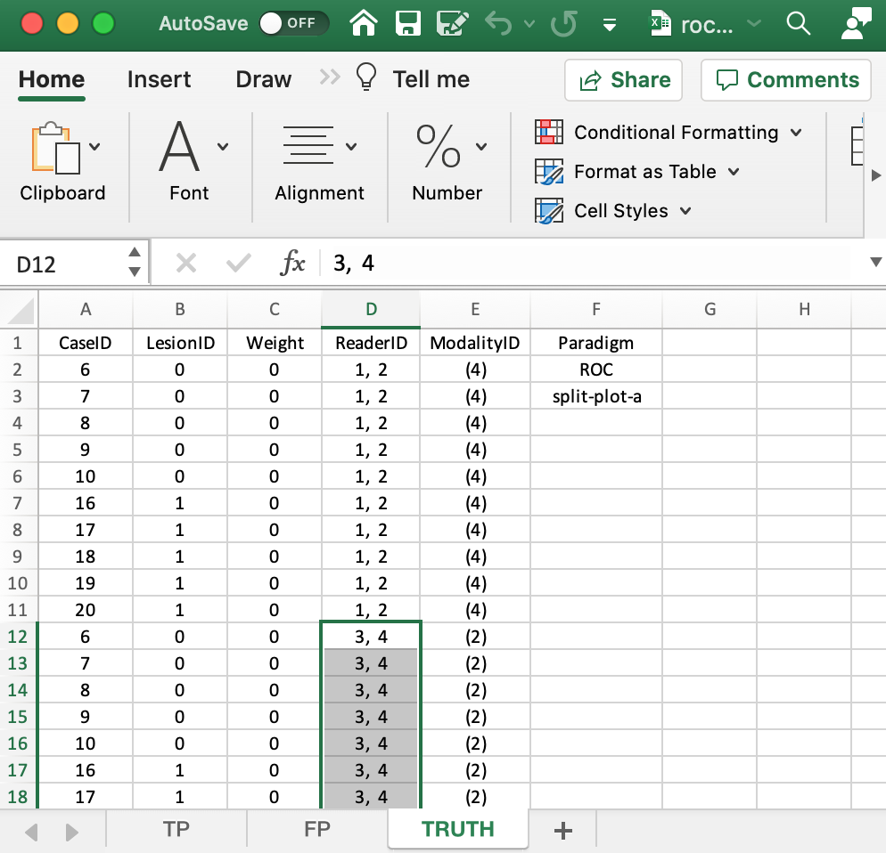
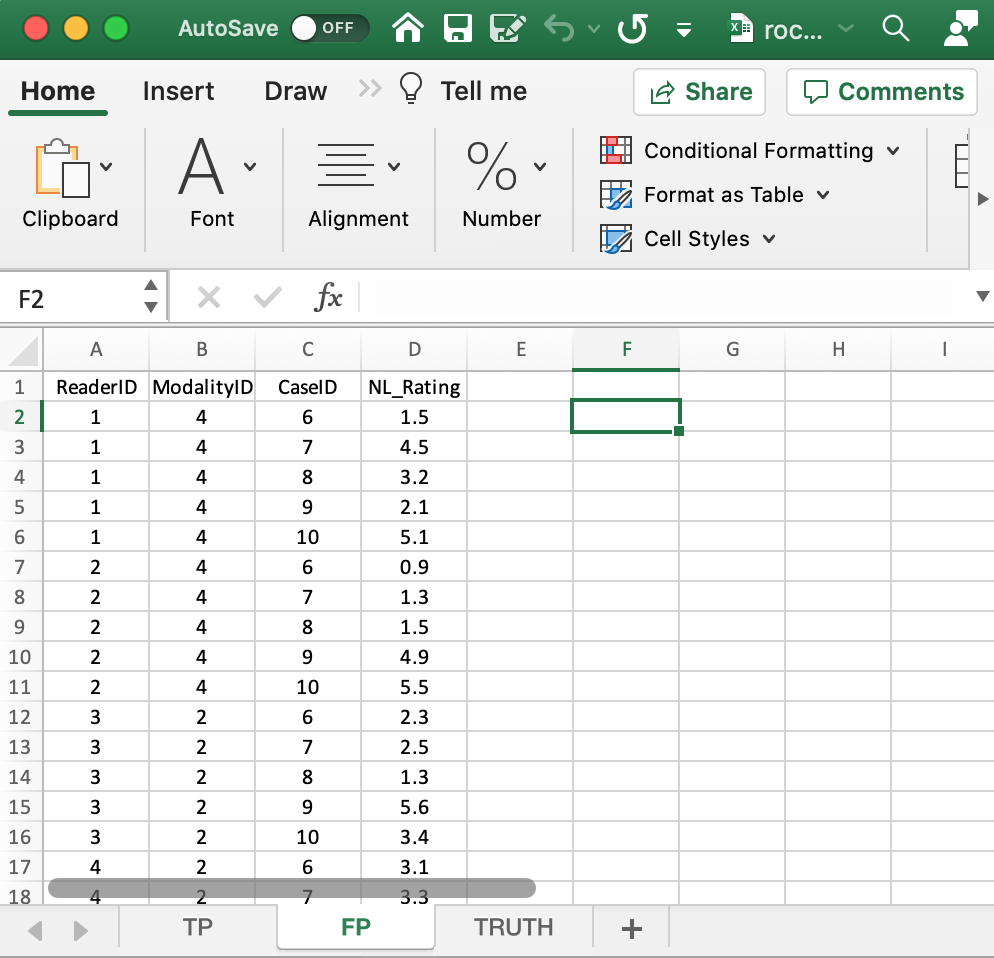
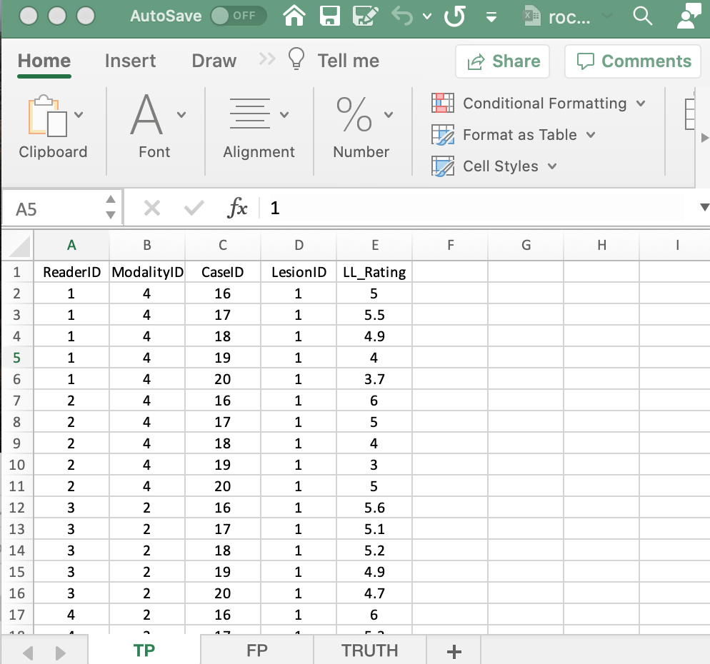

  
```{r setup, include = FALSE}
  knitr::opts_chunk$set(
  collapse = TRUE,
  comment = "#>"
  )
  library(RJafroc)
```

## Introduction
* The purpose of this vignette is to explain the data format of the input Excel file for an ROC *SPLIT-PLOT-A* dataset.
* The A refers to Table VII, part (a), in Hillis 2014.
* In SPLIT-PLOT-A dataset two distinct groups of readers interpret all cases in two different modalities.
* The vignette is illustrated with a toy data file, inst/extdata/toyFiles/ROC/rocSpA.xlsx.
* This file illustrates ROC data in which readers 1 and 2 interpret 10 cases in the first modality and readers 3 and 4 interpret the same cases in the second modality.
* The Excel file has three worsheets named `Truth`, `NL` (or `FP`) and `LL` (or `TP`). 

## The `Truth` worksheet 
* The `Truth` worksheet contains 6 columns: `CaseID`, `LesionID`, `Weight`, `ReaderID`, `ModalityID` and `Paradigm`. 
* The first five columns contain twice as many rows as there are distinct cases in the dataset. 
* The normal cases are numbered 6,7,8,9,10; the abnormal cases are numbered 16,17,18,19,20. Therefore, K1 = K2 = 5 and K = 10.
* The number of rows of data is 2 * K = 20.The factor of two is coming from the two modalities.
* The `ReaderID` field for the first modality has *two values* `1,2`, implying that readers 1 and 2 interpret all cases in the first modality. The corresponding values for the second modality are '3,4',
* `Weight`: floating point value 0: this is not used for ROC data.  
* `ModalityID`: In the example shown below each cell has the value `4` for the first modality and '2' for the second modality. Remember that like `ReaderID`, the `ModalityID` values are *text formatted labels*. 
* `Paradigm`: In the example shown below the contents of this field are `ROC` and `SPLIT-PLOT-A`. 

{width=100%}

## The structure of the ROC split-plot-A dataset
The example shown above corresponds to Excel file `inst/extdata/toyFiles/ROC/rocSpA.xlsx` in the project directory. The following code reads the data into a split plot dataset. 

```{r}
rocSpA <- system.file("extdata", "toyFiles/ROC/rocSpA.xlsx",
                        package = "RJafroc", mustWork = TRUE)
x <- DfReadDataFile(rocSpA, newExcelFileFormat = TRUE)
str(x)
```             

* Flag `newExcelFileFormat` **must** be set to `TRUE` to the read split plot dataset. 
* The dataset object `x` is a `list` variable with 3 members: `x$ratings`, `x$lesions` and `x$descriptions`.
* There are `K2 = 5` diseased cases (the length of the third dimension of ratings$LL) and `K1 = 5` non-diseased cases (the length of the third dimension of ratings$NL minus K2). 
* `x$NL`, with dimension [2, 4, 10, 1], contains the ratings of normal cases. 
* `x$LL`, with dimension [2, 5, 5, 1], contains the ratings of abnormal cases.
* The `x$perCase` member is a vector with 5 ones representing the 5 diseased cases. 
* The `x$IDs` member is an array with 5 ones.
* The `x$weights` member is an array with 5 ones.
* The `dataType` member is `r x$dataType` which specifies the data collection method, `"ROC"` in this example. 
* The `x$modalityID` member is a vector with two elements `"4"` and `"2"`, naming the two modalities. 
* The `x$readerID` member is a vector with four elements `"1"`, `"2"`, `"3"`, `"4", labeling the four readers. 
* The `x$design` member is `r x$design`; specifies the dataset design, "SPLIT-PLOT-A" for this example. 
* The `x$descriptions$truthTableStr` member quantifies the structure of the dataset, as explained next.

## The `truthTableStr` member 
* This is a `2 x 4 x 10 x 2` array, i.e., I x J x K x (maximum number of lesions per case plus 1). The `plus 1 ` is needed to accommodate normal cases. 
* Each entry in this array is either `1`, meaning the corresponding interpretation exists, or `NA`,  meaning the corresponding interpretation does not exist. 
* For example, `x$descriptions$truthTableStr[1,1,1,1]` is `r x$descriptions$truthTableStr[1,1,1,1]`. This means that an interpretation exists for the first treatment (`modalityID` = 1), first reader (`readerID` = 1) and first (normal) case (`caseID` = 6 and `IDs` = 0). This example corresponds to row 2 in the `TRUTH` worksheet.
* The following shows that the first reader interprets the first five normal cases in both modalities. 

```{r}
x$descriptions$truthTableStr[,1,1:10,1]
```             

* In the following all elements are `NA` because normal cases correspond to IDs = 1. 

```{r}
x$descriptions$truthTableStr[,1,1:10,2]
```             

* The following shows that the second reader interprets the next group of five normal cases, indexed 6 through 10, in both modalities. 

```{r}
x$descriptions$truthTableStr[,2,1:10,1]
```             

* The following shows that the third reader interprets the next group of five normal cases, indexed 11 through 15, in both modalities. 

```{r}
x$descriptions$truthTableStr[,3,1:10,1]
```             


## The false positive (FP) ratings
These are found in the `FP` or `NL` worksheet, see below.
{width=100%}

* This worksheet has the ratings of non-diseased cases. 
* The common vertical length is 30 in this example (2 modalities times 3 readers times 5 non-diseased cases per reader). 
* `ReaderID`: the reader labels: these must be from `1`, `4` or `5`, as declared in the `Truth` worksheet. 
* `ModalityID`: the modality labels: `1` or `2`, as declared in the `Truth` worksheet. 
* `CaseID`: the labels of non-diseased cases. Each `CaseID` - `ReaderID` combination must be consistent with that declared in the `Truth` worsheet.  
* `NL_Rating`: the floating point ratings of non-diseased cases. Each row of this worksheet yields a rating corresponding to the values of `ReaderID`, `ModalityID` and `CaseID` for that row.


```{r}
x$NL[,1,1:10,1]
x$NL[,2,1:10,1]
x$NL[,3,1:10,1]
```             


## The true positive (TP) ratings
These are found in the `TP` or `LL` worksheet, see below.

{width=100%}

* This worksheet has the ratings of diseased cases. 
* The common vertical length is 30 in this example (2 modalities times 3 readers times 5 diseased cases per reader). 
* `ReaderID`: the reader labels: these must be from `1`, `4` or `5`, as declared in the `Truth` worksheet. 
* `ModalityID`: the modality labels: `1` or `2`, as declared in the `Truth` worksheet. 
* `CaseID`: the labels of diseased cases. Each `CaseID` - `ReaderID` combination must be consistent with that declared in the `Truth` worsheet.  
* `LL_Rating`: the floating point ratings of diseased cases. Each row of this worksheet yields a rating corresponding to the values of `ReaderID`, `ModalityID` and `CaseID` for that row.


```{r}
x$LL[,1,1:10,1]
x$LL[,2,1:10,1]
x$LL[,3,1:10,1]
```             

* The first line of code shows the ratings, in both modalities, of the first five diseased cases with `CaseID`s `16,17,18,19,20` (indexed `r 1:5`and appearing in the first five columns) interpreted by the first reader (`ReaderID` 1).
* The second line shows the ratings, in both modalities, of the next five diseased cases with `CaseID`s `36,37,38,39,40` (indexed `r 6:10`and appearing in the next five columns) interpreted by the second reader (`ReaderID` 4).
* The third line shows the ratings, in both modalities, of the final five non-diseased cases with `CaseID`s `51,52,53,54,55` (indexed `r 11:15`and appearing in the final five columns) interpreted by the third reader (`ReaderID` 5).


## Summary  
* The FROC dataset has far less regularity in structure as compared to an ROC dataset.
* The length of the first dimension of either `x$NL` or `x$LL` list members is the total number of modalities, 2 in the current example.
* The length of the second dimension of either `x$NL` or `x$LL` list members is the total number of readers, 3 in the current example.
* The length of the third dimension of `x$NL` is the total number of cases, 8 in the current example. The first three positions account for `NL` marks on non-diseased cases and the remaining 5 positions account for `NL` marks on diseased cases.
* The length of the third dimension of `x$LL` is the total number of diseased cases, 5 in the current example. 
* The length of the fourth dimension of `x$NL` is determined by the case (diseased or non-diseased) with the most `NL` marks, 2 in the current example.
* The length of the fourth dimension of `x$LL` is determined by the diseased case with the most lesions, 3 in the current example.


## References  
