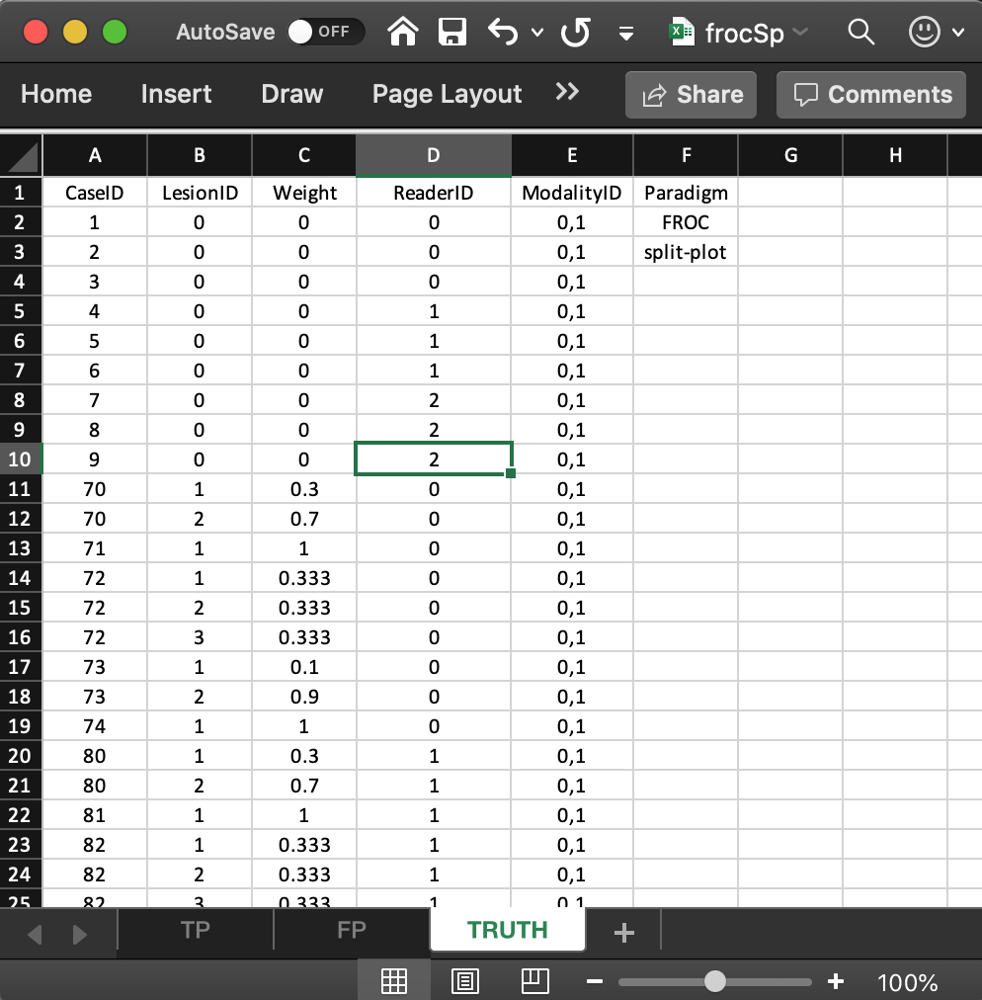
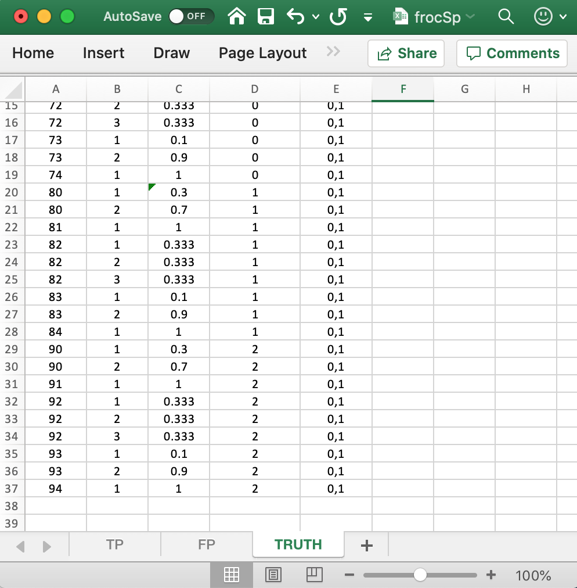
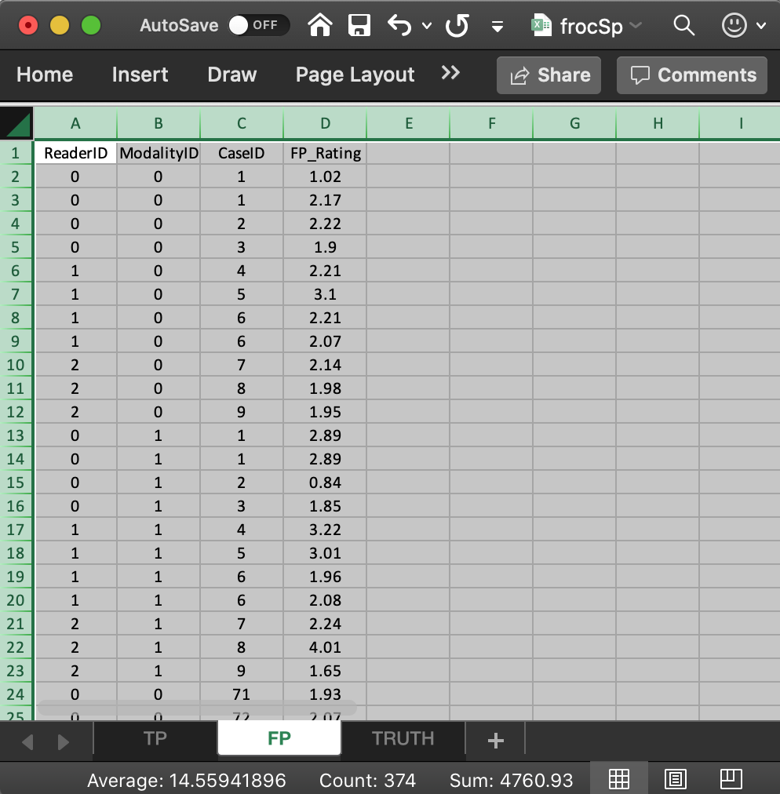
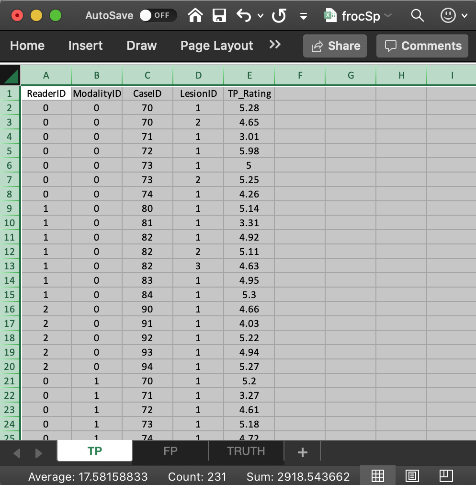

  
```{r setup, include = FALSE}
  knitr::opts_chunk$set(
  collapse = TRUE,
  comment = "#>"
  )
  library(RJafroc)
```

## Introduction
* The purpose of this vignette is to explain the data format of the input Excel file for an FROC *split-plot* dataset.
* In a split-plot dataset each reader interprets a sub-set of cases in all modalities.
* The cases interpreted by different readers have no overlap. 
* It is assumed, for now, that each sub-set of cases has the same numbers of non-diseased and diseased cases.

## The Excel data format
The Excel file has three worsheets named `Truth`, `NL` or `FP` and `LL` or `TP`. 

## The `Truth` worksheet 
The `Truth` worksheet contains 6 columns: `CaseID`, `LesionID`, `Weight`, `ReaderID`, `ModalityID` and `Paradigm`. 

* The first five columns contain as many rows as there are non-diseased cases (9) plus total number of lesions (27) in the dataset (each row with a non-zero `LesionID` corresponds to a lesion). 
* `CaseID`: unique **integers**, one per case, representing the cases in the dataset. 
* `LesionID`: integers 0, 1, 2, etc., with each 0 representing a non-diseased case, 1 representing the *first* lesion on a diseased case, 2 representing the second lesion on a diseased case, if present, and so on. 
* The three non-diseased cases interpreted by reader with `ReaderID`  value `0` are labeled `1`, `2`, `3`, while the diseased cases interpreted by this reader are labeled `70`, `71`, `72`, `73` and `74`, with `LesionID` values ranging from 1 to 3.  
* The second reader, with `ReaderID` value `1`, interprets three non-diseased cases labeled `4`, `5` and `6`, each with `LesionID` value `0`, and five diseased cases labeled `80`, `81`, `82`, `83` and `84`, with `LesionID` values ranging from 1 to 3.  
* The third reader, with `ReaderID` value `2`, interprets three non-diseased cases labeled `7`, `8` and `9`, each with `LesionID` value `0` and five diseased cases labeled `90`, `91`, `92`, `93` and `94`, with `LesionID` values ranging from 1 to 3.  
* `Weight`: floating point value adding upto unity for diseased cases as required for FROC data.
* `ModalityID`: a comma-separated listing of modalities, each represented by a unique **integer**. In the example shown below each cell has the value `0, 1`. **Each cell has to be text formatted.**
* `Paradigm`: In the example shown below, the contents are `FROC` and `split-plot`. 

{width=100%}
{width=100%}


## The structure of the FROC split plot dataset
The example shown above corresponds to Excel file `inst/extdata/toyFiles/FROC/frocSp.xlsx` in the project directory. 

```{r}
frocSp <- system.file("extdata", "toyFiles/FROC/frocSp.xlsx",
                        package = "RJafroc", mustWork = TRUE)
x <- DfReadDataFile(frocSp, newExcelFileFormat = TRUE)
str(x)
```             

* Flag `newExcelFileFormat` **must** be set to `TRUE` for split plot data. 
* The dataset object `x` is a `list` variable with `r length(x)` members. 
* Note that the `dataType` member is `r x$dataType` and the `design` member is `r x$design`. 
* There are 15 diseased cases in the dataset (the number of 1's in the `LesionID` column of the `Truth` worksheet) and 9 non-diseased cases (the number of 0's in the `LesionID` column). 
* The `x$lesionVector` member is a vector with 15 ones representing the 15 diseased cases in the dataset. 
* The `x$lesionID` member is a 15 x 3 array labeling the lesions in the dataset.
* The `x$lesionWeight` member is a 15 x 3 array.

```{r}
x$lesionVector
x$lesionID
x$lesionWeight
```             

* The `x$truthTableStr` member is a `2 x 3 x 24 x 4` array, i.e., I x J x K x (maximum number of lesions per case plus 1). The `plus 1 ` is needed to accommodate normal cases with `lesionID` = 0. 
* Each entry in this array is either `1`, meaning the corresponding interpretation exists, or `NA`,  meaning the corresponding interpretation does not exist. 
* For example, `x$truthTableStr[1,1,1,1]` is `r x$truthTableStr[1,1,1,1]`. This means that an interpretation exists for the first treatment (`modalityID` = 0), first reader (`readerID` = 0) and first (normal) case `caseID` = 1 and `lesionID` = 0. This example corresponds to row 2 in the `TRUTH` worksheet.
* `x$truthTableStr[1,1,4,1]` is `r x$truthTableStr[1,1,4,1]`, which means an interpretation does not exist for the first treatment, first reader and fourth (normal) case. 
* However, `x$truthTableStr[1,2,4,1]` is `r x$truthTableStr[1,2,4,1]`, which means an interpretation does exist for the first treatment, second reader and fourth (normal) case. This example corresponds to row 5 in the `TRUTH` worksheet.
* Likewise, `x$truthTableStr[1,1,10,3]` is `r x$truthTableStr[1,1,10,3]`, which means an interpretation does exist for the first treatment, first reader, tenth (abnormal) case and `lesionID` = 2. This example corresponds to row 12 in the `TRUTH` worksheet.
* As an aside, in the FROC paradigm an interpretation need not yield a mark-rating pair. An interpretation means the reader was "exposed to" and had the opportunity to mark the corresponding treatment-reader-case-lesion combination.
* The reader should confirm that the contents of `x$truthTableStr` summarizes the structure of the data in the `TRUTH` worksheet.


## The false positive (FP) ratings
These are found in the `FP` or `NL` worksheet, see below.

{width=100%}

* This worksheet has the ratings of non-diseased cases. 
* The common vertical length is 30 in this example (2 modalities times 3 readers times 5 non-diseased cases per reader). 
* `ReaderID`: the reader labels: these must be from `0`, `1` or `2`, as declared in the `Truth` worksheet. 
* `ModalityID`: the modality labels: `0` or `1`, as declared in the `Truth` worksheet. 
* `CaseID`: the labels of non-diseased cases. Each `CaseID`, `ModalityID`, `ReaderID` combination must be consistent with that declared in the `Truth` worsheet.  
* `FP_Rating`: the floating point ratings of non-diseased cases. Each row of this worksheet yields a rating corresponding to the values of `ReaderID`, `ModalityID` and `CaseID` for that row. Each `CaseID`, `ModalityID`, `ReaderID` combination must be consistent with that declared in the `Truth` worsheet. 


```{r}
x$NL[,1,1:9,1]
x$NL[,2,1:9,1]
x$NL[,3,1:9,1]
```             

* The first line of the above code shows the ratings, in both modalities, of the first three non-diseased cases with `CaseID`s `1,3,3` (indexed `r 1:3` and appearing in the first three columns) interpreted by the first reader (`ReaderID` `0`).
* The second line shows the ratings, in both modalities, of the next three non-diseased cases with `CaseID`s `4,5,6` (indexed `r 4:6`and appearing in the next three columns) interpreted by the second reader (`ReaderID` `1`).
* The third line shows the ratings, in both modalities, of the final three non-diseased cases with `CaseID`s `7,8,9` (indexed `r 7:9`and appearing in the final three columns) interpreted by the third reader (`ReaderID` `2`).
* Values such as `x$NL[,,16:30,1]`, which are there for compatibility with FROC data, are all filled with `-Inf`.

## The true positive (TP) ratings
These are found in the `TP` or `LL` worksheet, see below.

{width=100%}

* This worksheet has the ratings of diseased cases. 
* The common vertical length is 30 in this example (2 modalities times 3 readers times 5 diseased cases per reader). 
* `ReaderID`: the reader labels: these must be from `0`, `1` or `2`, as declared in the `Truth` worksheet. 
* `ModalityID`: the modality labels: `0` or `1`, as declared in the `Truth` worksheet. 
* `CaseID`: the labels of diseased cases. Each `CaseID`, `ModalityID`, `ReaderID` combination must be consistent with that declared in the `Truth` worsheet.  
* `TP_Rating`: the floating point ratings of diseased cases. Each row of this worksheet yields a rating corresponding to the values of `ReaderID`, `ModalityID` and `CaseID` for that row. Each `CaseID`, `ModalityID`, `ReaderID` combination must be consistent with that declared in the `Truth` worsheet. 


```{r}
x$LL[,1,1:15,1]
x$LL[,2,1:15,1]
x$LL[,3,1:15,1]
```             

* The first line of code shows the ratings, in both modalities, of the first five diseased cases with `CaseID`s `70,71,72,73,74` (indexed `r 1:5` and appearing in the first five columns) interpreted by the first reader (`ReaderID` `0`).
* The second line shows the ratings, in both modalities, of the next five diseased cases with `CaseID`s `80,81,82,83,84` (indexed `r 6:10` and appearing in the next five columns) interpreted by the second reader (`ReaderID` `1`).
* The third line shows the ratings, in both modalities, of the final five non-diseased cases with `CaseID`s `90,91,92,93,94` (indexed `r 11:15` and appearing in the final five columns) interpreted by the third reader (`ReaderID` `2`).


## Summary  


## References  
