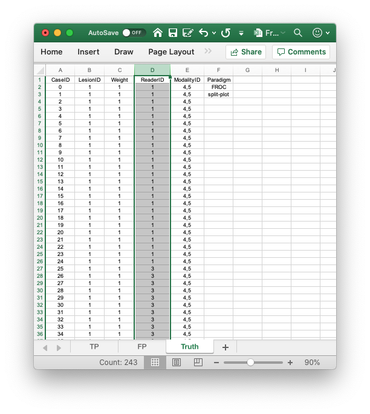

  
```{r setup, include = FALSE}
  knitr::opts_chunk$set(
  collapse = TRUE,
  comment = "#>"
  )
  library(RJafroc)
```

## This vignette is under construction!!
* This is a follow-up on the recently added (v1.3.1) capability to read a split-plot dataset.
* Lacking an actual split-plot dataset to test the routines, I decided to simulate one.


## The structure of an ROC dataset
The example shown below begins with the Excel file `inst/extdata/FrocData.xlsx` in the project directory (this is the FED dataset [@RN1882]). In the following code chunk the first statement retrieves the name of the data file, located in a hidden directory that one need not be concerned with. The second statement reads the file using the function `DfReadDataFile()` and saves it to object `x`. The remaining statements show some of the list members of the dataset object `x`.

```{r}
fed <- system.file("extdata", "FrocData.xlsx",
                       package = "RJafroc", mustWork = TRUE)
x1 <- DfReadDataFile(fed, newExcelFileFormat = FALSE)
str(x1$NL)
str(x1$LL)
t1 <- x1$truthTableStr
str(t1)
```             

* This shows that there are 100 normal and 100 abnormal cases in this two-modality four-reader crossed dataset.
* In the above code chunk `t1` is the original crossed dataset `truthTableStr`.
* Recall from earlier vignette that for the fourth index of `t1` the value 1 applies to cases with no lesions (normals), value 2 applies to cases with one lesion, value 3 applies to cases with two lesions and 4 applies to cases with three lesions.

## Recap of the truthTableStr object `t1`
* The value for any allowed interpretation is 1 and otherwise it is `NA`.
* The first line below yields zero as reader 1 provides interpretations in both modalities for all normal cases.
* The second line also yields zero as readers 1:4 provide interpretations in both modalities for all normal cases.
* The third line yields 200 because the fourth index 1 applies to normal cases while the case index (third index) corresponds to abnormal cases. Therefore, for the two modalities each of the 100 abnormal cases contributes an `NA`, leading to 200 `NA`s.
* The fourth line yields 0 because the fourth index 2 applies to abnormal cases with one lesion, and each abnormal case is guaranteed to have at least one lesion. 
* The fifth line yields 138 because the fourth index 3 applies to abnormal cases with two lesions, and careful inspection of the `LesionID` column in the original Excel file reveals that 31 abnormal cases have at least two lesions. [Try the following code: `sum(x1$lesionVector > 1)`.] This implies 100-31 = 69 cases do not meet the two lesion criterion, and 69 times 2 modalities equals 138. 
* The sixth line yields 178 because the fourth index  4 applies to abnormal cases with at least three lesions. Careful inspection of the `LesionID` column reveals that 11 abnormal cases have three lesions. [Try the following code: `sum(x1$lesionVector > 2)`.] This implies 100-11 = 89 cases do not meet the three lesion criterion, and 89 times 2 modalities equals 178. 

```{r}
sum(is.na(t1[,1,1:100,1]))
sum(is.na(t1[,,1:100,1]))
sum(is.na(t1[,1,101:200,1]))
sum(is.na(t1[,1,101:200,2]))
sum(is.na(t1[,1,101:200,3]))
sum(is.na(t1[,1,101:200,4]))
```             


* We show next how to create the truth table structure of a simulated split-plot dataset from the crossed dataset. 

## Modify the truth table structure to simulate a split-plot design
* The basic idea is to delete (or trim) interpretations that do not belong in a split-plot design.
* We divide the 100 normal and 100 abnormal cases into 4 groups of 25 normal and 25 abnormal cases, where each group is interpreted by one reader only.
* At code line 1, assuming reader 1 interprets normal cases `1:25`, we set `t1[,1,26:100,1]` to `NA`.
* This deletes all normal case interpretations that do not belong to reader 1.
* At code line 1, assuming reader 1 interprets abnormal cases `1:25` (actual case index `101:125`), we set `t1[,1,126:200,]` to `NA`.
* This deletes all abnormal case interpretations that do not belong to reader 1.
* Notice that for normal cases the fourth index is 1, as other values for this index already have `NA` in them.
* Notice that for abnormal cases the fourth index is blank, as this index accommodates different numbers of lesions per case.
* At code line 2, assuming reader 2 interprets normal cases `26:50`, we set `t1[,2,1:25,1]` to `NA` and `t1[,1,51:100,]` to `NA`.
* This deletes all normal case interpretations that do not belong to reader 2.
* At code line 2, assuming reader 2 interprets abnormal cases `26:50` (actual case index `126:150`), we set `t1[,2,101:125,]` to `NA` and `t1[,1,151:200,]` to `NA`.
* This deletes all abnormal case interpretations that do not belong to reader 2.
* Etc.

```{r}
t1[,1,26:100,1] <- NA;t1[,1,126:200,] <- NA
t1[,2,1:25,1] <- NA;t1[,2,51:100,1] <- NA;t1[,2,101:125,] <- NA;t1[,2,151:200,] <- NA
t1[,3,1:50,1] <- NA;t1[,3,76:100,1] <- NA;t1[,3,101:150,] <- NA;t1[,3,176:200,] <- NA
t1[,4,1:75,1] <- NA;t1[,4,101:175,] <- NA
```             

## Create a split-plot dataset file
* This is done (the "hard way") by manually making apppropriate changes to `inst/extdata/FrocData.xlsx` and saving the results to `inst/extdata/toyFiles/FROC/FrocDataSp.xlsx`.
* Make appropriate modifications to `Truth` sheet `ModalityID` column, as per following figure.

{width=100%}


* Notice that the `ReaderID` column **does not** consist of multiple readers separated by commas.
* As an example, reader 1 now interprets only cases `0` through `24`, which represent (abnormal) case indices `101:125`.
* The 25 normal cases for this reader are near the bottom of this sheet.
* Readers 3, 4 and 5 are likewise designated in this sheet. 
* Next we delete unwanted interpretations (for example, interpretatons of case index 1 by reader 2) in `FP` and `TP` sheets.
* Finally, we test the changes by reading the data file using `DfReadDataFile`.


```{r}
fedsp <- system.file("extdata", "toyFiles/FROC/FrocDataSp.xlsx",
                       package = "RJafroc", mustWork = TRUE)
x2 <- DfReadDataFile(fedsp, newExcelFileFormat = TRUE)
```             

* The truth table structure `t2` extracted below should be identical to `t1` (`testthat::expect_equal` produces no output if the test is successful).

```{r}
t2 <- x2$truthTableStr
testthat::expect_equal(t1, t2)
```             

* We confirm that the deletions for normal cases:

```{r}
testthat::expect_equal(x1$NL[,1,1:25,1], x2$NL[,1,1:25,1])
testthat::expect_equal(x1$NL[,2,26:50,1], x2$NL[,2,26:50,1])
testthat::expect_equal(x1$NL[,3,51:75,1], x2$NL[,3,51:75,1])
testthat::expect_equal(x1$NL[,4,76:100,1], x2$NL[,4,76:100,1])
```             

* We confirm that the deletions for NL ratings on abnormal cases:

```{r}
testthat::expect_equal(x1$NL[,1,101:125,], x2$NL[,1,101:125,])
testthat::expect_equal(x1$NL[,2,126:150,], x2$NL[,2,126:150,])
testthat::expect_equal(x1$NL[,3,151:175,], x2$NL[,3,151:175,])
testthat::expect_equal(x1$NL[,4,176:200,], x2$NL[,4,176:200,])
```             

* We confirm that the deletions for LL ratings on abnormal cases:

```{r}
testthat::expect_equal(x1$LL[,1,1:25,], x2$LL[,1,1:25,])
testthat::expect_equal(x1$LL[,2,26:50,], x2$LL[,2,26:50,])
testthat::expect_equal(x1$LL[,3,51:75,], x2$LL[,3,51:75,])
testthat::expect_equal(x1$LL[,4,76:100,], x2$LL[,4,76:100,])
```             

* All done!

## References  
