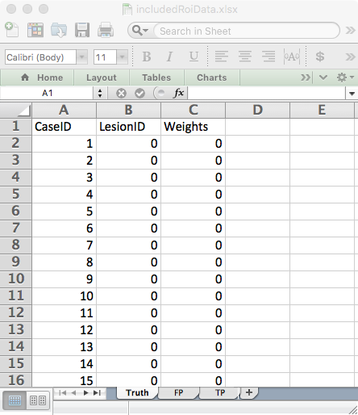
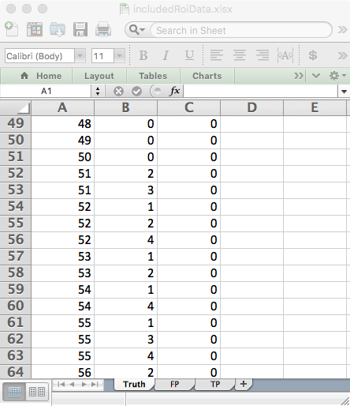
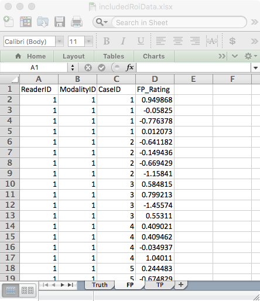
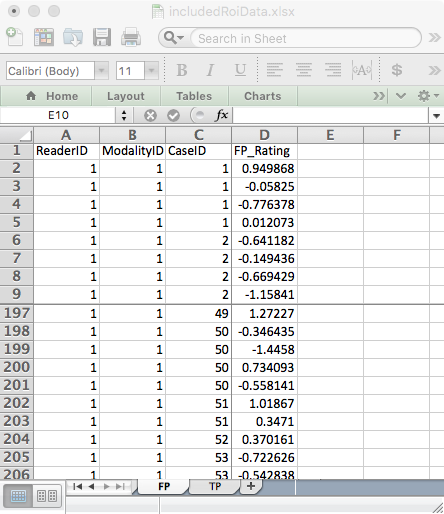
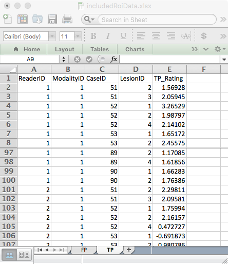

  
```{r setup, include = FALSE}
  knitr::opts_chunk$set(
  collapse = TRUE,
  comment = "#>"
  )
  library(RJafroc)
```

## Introduction
* In the region-of-interest (ROI) paradigm [@RN1233,@RN55] each case is regarded as consisting of ${{Q}_{k}}$ (${{Q}_{k}}\ge 1$) "quadrants" or "regions-of-interest" or ROIs, where *k* is the case index ($k=1,2,...,K$) and $K$ is the total number of cases (i.e., case-level non-diseased plus case-level diseased cases). Each ROI needs to be classified, by the investigator, as either ROI-level-non-diseased (i.e., it has no lesions) or ROI-level-diseased (i.e., it has at least one lesion). **Note the distinction between case-level truth and ROI-level truth states.** One can have ROI-level-non-diseaseds in a case-level-diseased case. A case-level-diseased case must contain at least one ROI-level-diseased region and a case-level non-diseased cannot have any ROI-level-diseased regions.

* The observer gives a single rating to each ROI, denoted ${{R}_{k}}$. The rating can be an integer or quasi- continuous (e.g., 0 – 100), or a floating point value, as long as higher numbers represent greater confidence in presence of one or more lesions in the ROI.

* The ROI paradigm is not restricted to 4 or even a constant number of ROIs per case. That is the reason for the *k* subscript in ${{Q}_{k}}$.

* The ROI data structure is a special case of the FROC data structure, the essential difference being that the number of ratings per case is an a-priori known value.

* ROI-level-non-diseased ratings are stored in the `NL` field and ROI-level-diseased ratings are stored in the `LL` field.  

* One can think of the ROI paradigm as similar to the FROC paradigm, but with localization accuracy restricted to belonging to a region (one cannot distinguish multiple lesions within a region). Unlike the FROC paradigm, a rating *is required* for every ROI.


## An example ROI dataset

An example simulated ROI dataset is included as `datasetROI`.
  
```{r}
str(datasetROI)
datasetROI$NL[1,1,1,]
mean(datasetROI$NL[,,1:50,])
datasetROI$NL[1,1,51,]
datasetROI$lesionVector[1]
datasetROI$LL[1,1,1,]
x <- datasetROI$LL;mean(x[is.finite(x)])
```             
Examination of the output reveals that:

* This is a 2-treatment 5-reader dataset, with 50 non-diseased cases and 40 diseased cases, and ${{Q}_{k}}=4$ for all *k*.   

* For treatment 1, reader 1, case 1 (the 1st non-diseased case) the 4 ratings are `r datasetROI$NL[1,1,1,]`. The mean of all ratings on non-diseased cases is `r mean(datasetROI$NL[,,1:50,])`.  

* For treatment 1, reader 1, case 51 (the 1st diseased case) the NL ratings are `r datasetROI$NL[1,1,51,][is.finite(datasetROI$NL[1,1,51,])]`. There are only two finite values because this case has two ROI-level-diseased regions, and 2 plus 2 makes for the assumed 4-regions per case. The corresponding `$lesionVector` field is `r datasetROI$lesionVector[1]`.   
* The ratings of the 2 ROI-level-diseased ROIs on this case are `r datasetROI$LL[1,1,1,][is.finite(datasetROI$LL[1,1,1,])]`. The mean rating over all ROI-level-diseased ROIs is `r mean(datasetROI$LL[is.finite(datasetROI$LL)])`.  

## The ROI  Excel data file
An Excel file in JAFROC format containing simulated ROI data corresponding to `datasetROI`, is included with the distribution. The first command (below) finds the location of the file and the second command reads it and saves it to a dataset object `ds`. !!!DPC!!! 
```{r}
## fileName <- system.file(
##     "extdata", "RoiData.xlsx", package = "RJafroc", mustWork = TRUE)
## ds <- DfReadDataFile(fileName)
## ds$dataType
```             
The `DfReadDataFile` function automatically recognizes that this is an *ROI* dataset. Its structure is similar to the JAFROC format Excel file, with some important differences, noted below. It contains three worksheets: 

{width=40%}
{width=40%}

* The `Truth` worksheet - this indicates which cases are diseased and which are non-diseased and the number of ROI-level-diseased region on each case.  
    + There are 50 non-diseased cases (labeled 1-50) under column `CaseID` and 40 diseased cases (labeled 51-90).  
    + The `LesionID` field for each non-diseased case (e.g., `CaseID` = 1) is zero and there is one row per case. For diseased cases, this field has a variable number of entries, ranging from 1 to 4. As an example, there are two rows for `CaseID` = 51 in the Excel file: one with `LesionID` = 2 and one with `LesionID` = 3.   
    + The `Weights` field is always zero (this field is not used in ROI analysis).  

{width=40%}
{width=40%}

* The `FP` (or `NL`)  worksheet - this lists the ratings of ROI-level-non-diseased regions.  
    + For `ReaderID` = 1, `ModalityID` = 1 and `CaseID` = 1 there are 4 rows, corresponding to the 4 ROI-level-non-diseased regions in this case. The corresponding ratings are `r datasetROI$NL[1,1,1,][is.finite(datasetROI$NL[1,1,1,])]`. The pattern repeats for other treatments and readers, but the rating are, of course, different.  
    + Each `CaseID` is represented in the `FP` worksheet (a rare exception could occur if a case-level diseased case has 4 diseased regions).

{width=40%}

* The `TP` (or `LL`) worksheet - this lists the ratings of ROI-level-diseased regions.  
    + Because non-diseased cases generate TPs, one does not find any entry with `CaseID` = 1-50 in the `TP` worksheet.   
    + The lowest `CaseID` in the `TP` worksheet is 51, which corresponds to the first diseased case.   
    + There are two entries for this case, corresponding to the two ROI-level-diseased regions present in this case. Recall that corresponding to this `CaseID` in the `Truth` worksheet there were two entries with `LesionID` = 2 and 3. These must match the `LesionID`'s listed for this case in the `TP` worksheet. Complementing these two entries, in the `FP` worksheet for `CaseID` = 51, there are 2 entries corresponding to the two ROI-level-non-diseased regions in this case.   
    + One should be satisfied that for each diseased case the sum of the number of entries in the `TP` and `FP` worksheets is always 4.  


## Next
The next vignette illustrates significance testing for this paradigm.  

## References  
